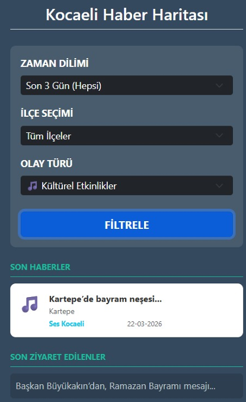
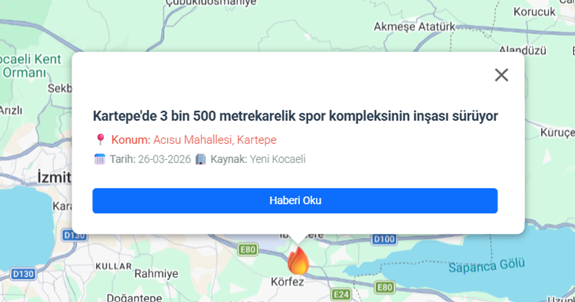
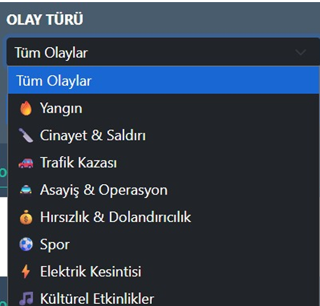
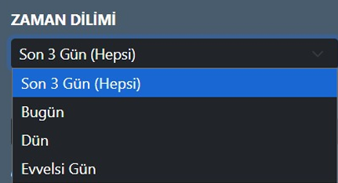
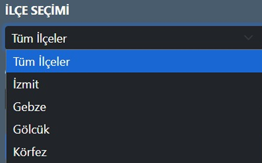
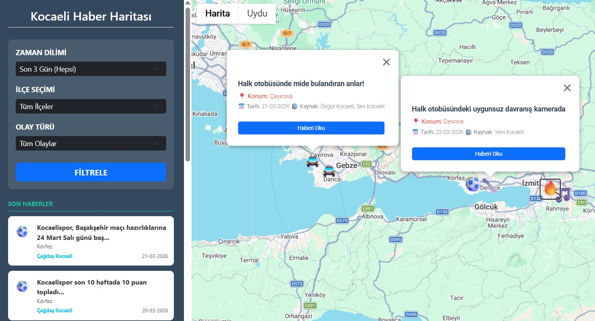

# Kocaeli Kentsel Haber İzleme ve Harita Görselleştirme Sistemi 🗺️📰

Bu proje, **Kocaeli Üniversitesi Bilgisayar Mühendisliği** Yazılım Laboratuvarı-II dersi kapsamında geliştirilmiş; Kocaeli iline ait yerel haber kaynaklarından dinamik veri toplayan, işleyen ve harita üzerinde görselleştiren web tabanlı bir sistemdir.

## 🚀 Projenin Amacı
Yerel haber sitelerinden web scraping (veri kazıma) yöntemleriyle güncel olay verilerini otomatik olarak toplamak, metin analiziyle sınıflandırmak ve geocoding mimarisiyle harita tabanlı etkileşimli bir arayüz üzerinden kullanıcıya sunmaktır.

## 🛠️ Teknolojik Altyapı
* **Backend Framework:** Python / Flask
* **Veritabanı (NoSQL):** MongoDB (Haber türü, başlık, içerik, link ve koordinat yönetimi)
* **Veri Kazıma (Scraping):** Python / BeautifulSoup & Requests
* **Harita Entegrasyonu:** Google Maps API / JavaScript
* **Coğrafi Kodlama:** Nominatim / Geocoding API
* **Doğrulama ve Analiz:** TF-IDF & Cosine Similarity (Metin Benzerliği Analizi)

## 🕹️ Sistem Nasıl Çalışır? (Aşama Aşama)
1. **Web Scraping:** Python modülü yerel haber kaynaklarını sürekli tarayarak ham HTML verilerini toplar.
2. **Veri Ön İşleme:** HTML etiketleri temizlenir ve metinler küçük harfe çevrilerek analiz edilebilir hale getirilir.
3. **Regex Tabanlı Sınıflandırma:** Haber içerikleri taranarak anahtar kelimelere göre otomatik olay türü (Yangın, Trafik Kazası, Cinayet, Spor, Kültürel Etkinlik vb.) belirlenir.
4. **Metin Benzerliği Kontrolü:** Yeni çekilen bir haber, son 72 saatteki verilerle Cosine Similarity kullanılarak karşılaştırılır. %90 ve üzeri benzerlikte haber tekilleştirilir, mükerrer kayıt engellenerek sadece yeni kaynak bilgisi eklenir.
5. **Coğrafi Konum Çıkarımı:** Metin hiyerarşik olarak (İlçe -> Mahalle -> Cadde/Sokak -> Önemli Kurumlar) analiz edilir. Elde edilen normalize adres, Google Maps API ile hassas koordinatlara (Enlem/Boylam) dönüştürülür.
6. **API Önbellekleme (Caching):** API maliyetlerini düşürmek için önceden sorgulanan konumlar yerel sözlük yapısında saklanır.


## 📊 Örnek Veritabanı Kayıt Yapısı (MongoDB)
```json
{
  "_id": "ObjectId(...)",
  "haber_turu": "Kültürel Etkinlikler",
  "haber_basligi": "Kütüphaneler Haftası'nda Gölcük'te öğrencilere tiyatro sürprizi",
  "konum_metin": "Gölcük",
  "kaynak_adi": ["Çağdaş Kocaeli"],
  "link": "[https://www.cagdaskocaeli.com.tr/](https://www.cagdaskocaeli.com.tr/)...",
  "yayin_tarihi": "25-03-2026 00:08",
  "koordinat": { "lat": 40.716, "lng": 29.818 }
}

## 👥 Geliştiriciler
* **Merve Kübra ÖZTÜRK**
* **İclal ÜSTÜN**

## 📸 Ekran Görüntüleri

 
 

